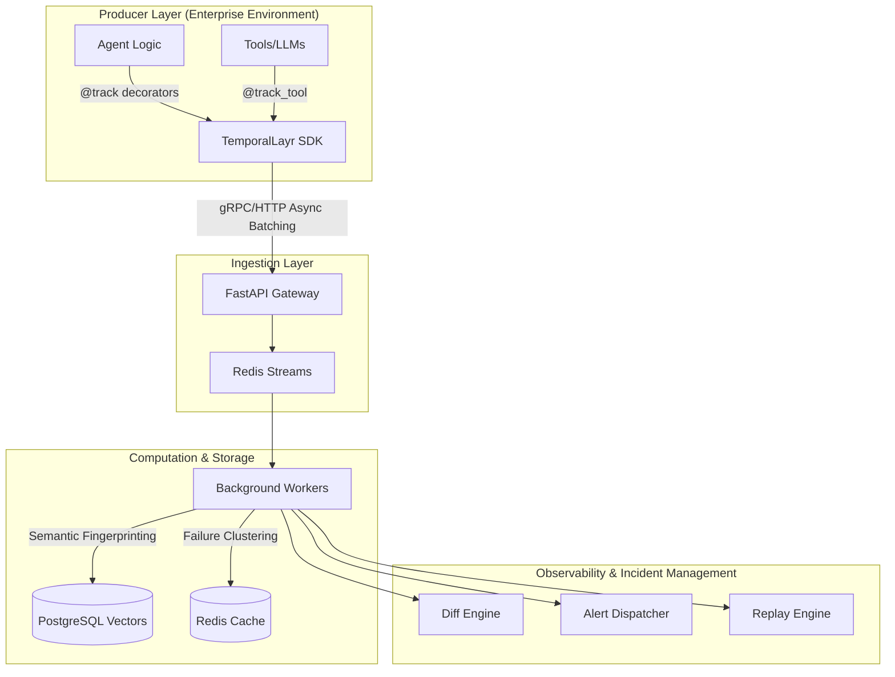

# TemporalLayr

**Production-Grade Telemetry, Governance, and Observability for Autonomous Agents.**

<div align="center">

[](https://opensource.org/licenses/MIT)
[](https://www.python.org)
[](https://github.com/astral-sh/ruff)
[](https://github.com/temporallayr/temporallayr-core/actions/workflows/ci.yml)
[](https://github.com/temporallayr/temporallayr-core/actions/workflows/ci.yml)

</div>

## The Inevitability of Autonomous Capital

As AI pipelines evolve from copilot suggestions to autonomous, high-stakes execution graphs, standard observability falls short. Simply logging "LLM response times" is not enough. You need deterministic replayability, failure clustering, semantic diffing of agent decisions, and instant incident response.

**TemporalLayr** is a distributed, resilient infrastructure layer that maps unconstrained AI execution into strict, queryable graphs.

---

## Architecture

TemporalLayr separates the instrumentation layer (SDK) from the ingestion and analytics layer (Server). The server relies on a highly concurrent PostgreSQL and Redis backbone to capture continuous streams of execution events, compute semantic fingerprints, and aggregate failure clusters in real time.



## Core Engine Capabilities

TemporalLayr abstracts away the complexity of auditing and debugging non-deterministic programs through specialized sub-engines:

- **Execution Graph Recorder (`core/recorder.py`)**: Captures complete branching logic of multi-agent interactions into a DAG (Directed Acyclic Graph), persisting states, inputs, and outputs.
- **Diff Engine (`core/diff_engine.py`)**: Semantically compares two execution traces to detect regressions in reasoning, unexpected tool usage, or latency degredation.
- **Failure Clustering (`core/failure_cluster.py`)**: Uses intelligent fingerprinting to group thousands of trace errors into a handful of distinct "failure signatures."
- **Alert Dispatcher (`core/alert_dispatcher.py`)**: Rule-based routing of critical incidents (e.g., LLM context limit exceeded, API key banned) to external services.
- **Deterministic Replay (`core/replay.py`)**: Re-inject recorded graph context into your local dev environment, bypassing actual LLM inference for blazingly fast debugging of intermediate logic.

---

## SDK Usage

We designed the SDK to be zero-overhead, async-first, and minimally invasive.

### Installation

```bash
pip install temporallayr
```

### 1. Initialization and Context Setup

Initialize the context at your application entry point.

```python
import os
import temporallayr

# Configure via environment or explicit init
os.environ["TEMPORALLAYR_SERVER_URL"] = "https://temporallayr-server-production.up.railway.app"
os.environ["TEMPORALLAYR_API_KEY"] = "your-tenant-key"
os.environ["TEMPORALLAYR_TENANT_ID"] = "production"

async def startup():
    temporallayr.init()
```

### 2. Zero-touch Instrumentation

Trace functions natively without modifying internal logic. Decorators are strongly typed and yield native performance via asynchronous background transport.

```python
from temporallayr.core.decorators import track, track_llm, track_tool

@track_tool
def fetch_user_data(user_id: str) -> dict:
    return {"id": user_id, "risk_score": 0.85}

@track_llm
async def generate_decision(risk_score: float) -> str:
    # Simulating LLM call
    if risk_score > 0.8: return "REJECT"
    return "APPROVE"

@track_pipeline
async def autonomous_decision_pipeline(user_id: str):
    data = fetch_user_data(user_id)
    decision = await generate_decision(data["risk_score"])
    return decision
```

### 3. Contextual Recording & Storage

For granular sub-graph captures, use the `ExecutionRecorder` context manager. It safely isolates tracking contexts, making it safe for highly concurrent request handling.

```python
from temporallayr.core.recorder import ExecutionRecorder

async def main():
    async with ExecutionRecorder() as recorder:
        # Internally builds an execution DAG mapping dependencies
        result = await autonomous_decision_pipeline("usr_12345")
    
    # Analyze the captured context immediately
    graph = recorder.graph
    print(f"Captured {len(graph.nodes)} execution nodes for trace {graph.id}")
```

---

## Server Deployment

The backend server is packaged for frictionless containerized deployment.

```bash
# Provision PostgreSQL, Redis, and the TemporalLayr API Services
docker-compose up -d
```

### Environment Configuration
| Variable | Description | Default |
|----------|-------------|---------|
| `TEMPORALLAYR_STORE` | Backend datastore type (`sqlite`, `postgres`) | `sqlite` |
| `TEMPORALLAYR_POSTGRES_DSN` | Connection string for Postgres | `postgresql://...` |
| `TEMPORALLAYR_REDIS_URL` | Redis instance for pub/sub & clustering | `redis://...` |
| `TEMPORALLAYR_RETENTION_DAYS` | Data retention policy | `30` |

---

## Why TemporalLayr? (For Technical Due Diligence)

* **Bounded Memory Footprint**: The SDK batches telemetry via memory-bounded async queues to prevent OOM errors on high-throughput agent swarms.
* **Network Partition Tolerance**: Failed POSTs to the ingestion endpoint degrade gracefully and utilize exponential backoffs. The host application will *never* crash due to a telemetry failure.
* **Deterministic Auditing**: Meets stringent enterprise compliance requirements by cryptographically binding LLM inputs to outputs and tying them to specific pipeline runs.

---
**TemporalLayr** · Building the bedrock for reliable Machine intelligence.


## SDK Public API

TemporalLayr exposes a stable, minimal API surface:

- `init(**kwargs)`
- `start_trace(trace_name=...)`
- `start_span(name=..., attributes=...)`
- `record_event(name=..., payload=...)`
- `flush()`
- `shutdown()`

All trace/span propagation uses `contextvars` to remain async-safe and thread-safe, and internal classes are intentionally hidden from the public surface.
